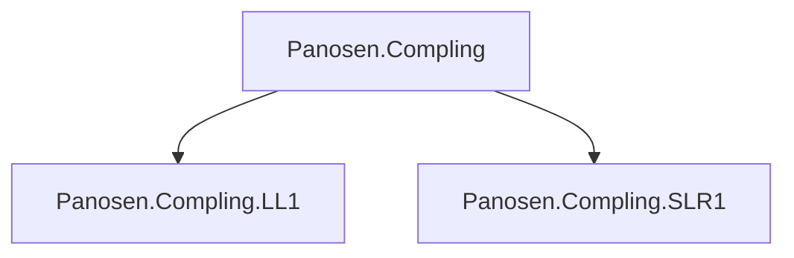

# panosen-compling
编译原理

```mermaid
graph TD;
Panosen.Compling --> Panosen.Compling.LL1

Panosen.Compling --> Panosen.Compling.SLR1

%%Panosen.Compling --> Panosen.Compling.MSTest

%%Panosen.Compling --> Panosen.Compling.Rules

%%Panosen.Compling.LL1 --> Panosen.Compling.LL1.MSTest
%%Panosen.Compling.Rules --> Panosen.Compling.LL1.MSTest

%%Panosen.Compling.Rules --> Panosen.Compling.MSTest
```

